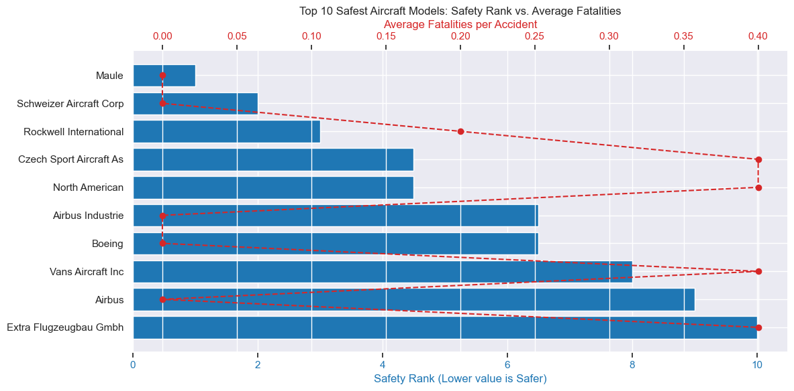

# Aviation-accidents---risk-assessment
**Risk assessments conducted on civil aviation accidents in the US**


Business Problem: Identifying Low-Risk Aircraft for Expansion into the Aviation Industry
## Background
Our company is diversifying its portfolio and is looking to expand into the aviation industry by purchasing and operating airplanes for both commercial and private enterprises. However, the aviation industry involves substantial risks, especially when it comes to aircraft safety. To make informed decisions, the company needs to understand the potential risks associated with different aircraft models to avoid costly accidents and reputation damage.

The goal is to evaluate various aircraft models based on historical accident data, identify the safest options, and provide actionable insights for selecting the best aircraft to purchase.

# Objective
We will analyze a dataset from the National Transportation Safety Board (NTSB) containing aviation accident records from 1962 to 2023. From this data, we will determine which aircraft models have the lowest risk in terms of accidents, fatalities, and serious injuries. These insights will then inform the decision on which aircraft to purchase for the company’s expansion into the aviation business.

### Specific Objectives
1. To determine which aircraft brands are historically associated with the lowest accident frequencies and better safety records.
2. To quantify the number of accidents per aircraft, helping to identify low-risk models based on historical data.
3. To evaluate the relationship between engine configuration and fatalities, and identify engine types that demonstrate better safety performance.
4. To understand when accidents most commonly occur (e.g., Takeoff, Landing, Cruise), providing operational insights that can guide risk management strategies during flight operations.

# Data
The dataset contains detailed records of civil aviation accidents and selected incidents in the United States and international waters. The key data columns we will be using include:
```
'Event.Id', 'Investigation.Type', 'Aircraft.Category'   'Make', 'Model','Airport.Name',
        'Number.of.Engines', 'Engine.Type', 'Year', 'Injury.Severity','US_territories',
        'Total.Fatal.Injuries', 'Total.Serious.Injuries', 'Broad.phase.of.flight',
        'Total.Minor.Injuries'
```

# Methods
### Data Cleaning & Preprocessing:

1. Handle missing data (e.g., impute missing values or drop rows with insufficient data). In our case we will drop the columns with more than 60% of missing values because some records are incomplete, and have missing values as seen in the missing values image below. These columns need to be cleaned.


2. We will then standardize the data formats ensuring that we have uniform uniform aircraft names, Models, Makes, etc and also dates have a date-time dtype().

3. Remove irrelevant or duplicated records.
4. We will filter the data using the use descriptive analysis to analyze the top airplane models.

### Analysis


***1. Data Aggregation:*** The dataset spans several decades and needs to be aggregated by aircraft model, accident type, and phase of flight.

***2. Risk Metric Creation:*** Defining a comprehensive risk metric that combines all the composite scores for accident count, severity of injuries, and the frequency of accidents across various aircraft models.
We will use these composite scores to generate a *risk* score for all the aircrafts.
- Average fatalities	0.4	Heaviest weight — deadlier = riskier
- Average serious injuries	0.3	Bad but less severe than fatalities
- Time since last accident	0.2	Newer = higher risk (because (2023 - year) is smaller)
- Total number of accidents	0.1	Minor weight — high count = slightly riskier

***3. Risk Calculation for the safest aircraft***

- Total Accidents: Fewer historical accidents indicate a safer aircraft model.
- Recent Accidents: Priority given to aircraft with minimal accidents in recent years.
- Accident Frequency: Aircraft with consistently low accident rates over time are favored.
- Survivability: Models with fewer fatal injuries and higher survival rates are considered safer.

NB: _Weighted Risk Score: All factors combined into a final score to rank aircraft safety objectively._

Operational Aspects that influence accidents
We also looked at the operational aspects that might be contributing to the number of accidents witnessed.
  
***4. Visualizaton and Insights***
Create interactive visualizations (e.g., bubble charts, heatmaps, bar plots) to display:

- The Top 10 Safest Aircraft Models.
- A comparison of Accident Risk across different aircraft makes and models.
- The Most Common Phases of Flight where accidents occur (Takeoff, Landing, etc.).

# Results
### Accidents timeline for Aircraft models


From the timeline generated we can see that the CESSNA and the PIPER have had more recent accidents than the rest, they have also had the most total historical accidents.

# Safety Rank vs Average Fatalities

When We looked at the average fatalities per airplane model and ranked them from the lowest to the highest, we identified SCHWEIZER and GLOBE to have the least fatalities and as expected CESSNA and PIPER were in the lower rankings.


Upon aggregating the top 10 safest models using the risk matrix generated, we identified Model G-1648 developed by the SCHWEIZER Corp to be the safest.

### Engine Analysis


From the enine analysis it was noted that the aircraft with 3 Turbo Jet engine had the best performance with the least fatality being noted from this class. 
It was also noted that generally multi-engine aircrafts have a higher fatality rate than their singular engine counterparts. This one needs further analysis to truly acertain it.

### Operations that caused accidents


From the operations aspect most of the accidents are caused during pilots landing the planes followed closely by those that are taking off.but interms of the average fatalities, climbing manouvres have the highest fatalities

# Recommendations
- When we are thinking about airplanes to purchase the company can consider purchasing the ****SCHWEIZER AICRAFT model G-164B*** which was ranked the highest on safety and was associated with very few recent accidents.
- The second alternative would be the ***GLOBE Model GC-1B*** which had few fatal injuries associated with it.
- From the analysis we also recommend taking aircrafts with the ****multi-engine Turbo Jet engines**** specifically the ones with 3 engines.
- We would recommend that pilots that would be flying these flights be thoroughly tained on aircraft safety precautions. - We would also recommend that the unknown causes of aircraft accidents be looked into.

### Tableau Dashboard

[Link to the tableau dashboard
](https://public.tableau.com/views/Book1_17457908309590/Dashboard1?:language=en-US&publish=yes&:sid=&:redirect=auth&:display_count=n&:origin=viz_share_link)

